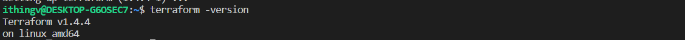
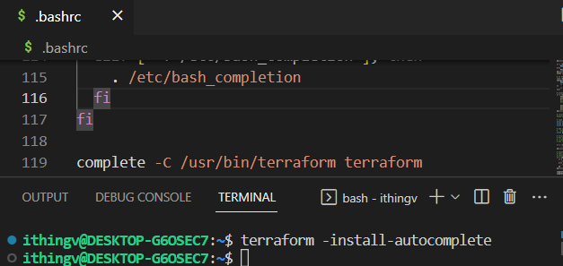

[1. 테라폼 설치 및 기본설정]()


**참고**
- [테라폼 Github](https://github.com/hashicorp/terraform)
- [HashiCorp 공식 홈페이지의 테라폼 설치가이드](https://developer.hashicorp.com/terraform/downloads)

----
- 환경
  - Windows 10
  - WSL Ubuntu 22.04

- 설치
```shell
wget -O- https://apt.releases.hashicorp.com/gpg | gpg --dearmor | sudo tee /usr/share/keyrings/hashicorp-archive-keyring.gpg

echo "deb [signed-by=/usr/share/keyrings/hashicorp-archive-keyring.gpg] https://apt.releases.hashicorp.com $(lsb_release -cs) main" | sudo tee /etc/apt/sources.list.d/hashicorp.list

sudo apt update && sudo apt install terraform
```


- version 확인
```shell
terraform -version
```


- terraform 명령어 자동 완성 기능 활성화
```shell
terraform -install-autocomplete
```


- [테라폼 캐시 설정](https://developer.hashicorp.com/terraform/cli/config/config-file)
  - 홈 디렉토리에 `.terraformrc` 파일을 (없다면) 생성하고 텍스트를 입력해야한다.
  - plugin cache 설정
    - 테라폼의 캐시 저장 공간을 중앙 집중식으로 관리
    - 각 워크스페이스마다 필요한 테라폼 프로바이더나 모듈을 다운로드 받을 때 동일한 파일의 경우 한번만 설치할 수 있도록 설정한다. 

```shell
# ~/.terraformrc
vi ~/.terraform.rc

# 텍스트 입력
plugin_cache_dir = "$HOME/.terraform.d/plugin-cache"

# 폴더 생성
mkdir ~/.terraform.d/plugin-cache
```